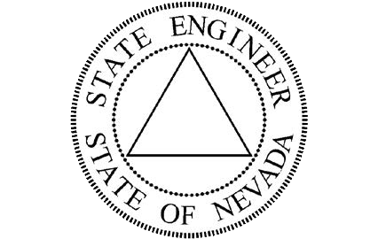
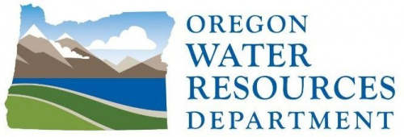

## Toward Sustainable Groundwater Management: Harnessing Remote Sensing and Climate Data to Estimate Field-Scale Groundwater Pumping

### PI: [Justin Huntington](https://www.dri.edu/directory/justin-huntington/)
### Software authors/maintainers: [Thomas Ott](https://www.dri.edu/directory/thomas-ott/), [Sayantan Majumdar](https://www.dri.edu/directory/sayantan-majumdar/)

 

## Citations
**Journal**: [Ott, T.J.](https://www.dri.edu/directory/thomas-ott/), [Majumdar, S.](https://www.dri.edu/directory/sayantan-majumdar/), 
[Huntington, J.L.](https://www.dri.edu/directory/justin-huntington/), 
[Pearson, C.](https://www.dri.edu/directory/chris-pearson/), [Bromley, M.](https://www.dri.edu/directory/matthew-bromley/), 
[Minor, B.A.](https://www.dri.edu/directory/blake-minor/), [Morton, C.G.](https://www.dri.edu/directory/charles-morton/), 
[Sueki, S.](https://www.dri.edu/directory/sachiko-sueki/), [Beamer, J.P.](https://www.linkedin.com/in/jordan-beamer-89ba8020/), & 
[Jasoni, R.](https://www.dri.edu/directory/richard-jasoni/). (2024). 
Toward Sustainable Groundwater Management: Harnessing Remote Sensing and Climate Data to Estimate Field-Scale Groundwater Pumping. _Submitted to Elsevier [Agricultural Water Management](https://www.sciencedirect.com/journal/agricultural-water-management) special issue on _Irrigation monitoring through Earth Observation (EO) data__.

## Abstract
Groundwater overdraft in western U.S. states has prompted water managers to start the development of groundwater management plans that include mandatory reporting of groundwater pumping (GP) to track water use. 
Most irrigation systems in the western U.S. are not equipped with irrigation water flow meters to record GP. Of those that do, performing quality assurance and quality control (QAQC) of the metered GP data is difficult due to the lack of reliable secondary GP estimates. 
We hypothesize that satellite (Landsat)-based actual evapotranspiration (ET) estimates from OpenET can be used to predict GP and aid in QAQC of the metered GP data. For this purpose, the objectives of this study are: 
1) To pair OpenET estimates of consumptive use (Net ET, i.e., actual ET less effective precipitation) and metered annual GP data from Diamond Valley (DV), Nevada, and Harney Basin (HB), Oregon; 
2) To evaluate linear regression and ensemble machine learning (ML) models (e.g., Random Forests) to establish the GP vs Net ET relationship; and
3) To compare GP estimates at the field- and basin-scales. 

Results from using a bootstrapping technique showed that the mean absolute errors (MAEs) for field-scale GP depth are 12% and 11% for DV and HB, respectively, and the corresponding root mean square errors (RMSEs) are 15% and 14%. Moreover, the regression models explained 50%-60% variance in GP depth and ~90% variance in GP volumes. The estimated average irrigation efficiency of 88% (92% and 83% for DV and HB, respectively) aligns with known center pivot system efficiencies. Additionally, OpenET proves to be useful for identifying discrepancies in the metered GP data, which are subsequently removed prior to model fitting. Results from this study illustrate the usefulness of satellite-based ET estimates for estimating GP, QAQC metered GP data and have the potential to help estimate historical GP.

**Keywords:** groundwater pumping; remote sensing; evapotranspiration; irrigation; machine learning; consumptive use

## Broader Project Summary
**Title**: [Nevada Water Resources Initiative](http://water.nv.gov/documents/NDWR_Strategic-Plan_FY23-27.pdf)

**Major Goals**: The primary goals will be to estimate water use across the state associated with
agriculture and natural groundwater discharge areas, and perform data collection and
monitoring that will be used for water use model development and validation. These estimates
will be foundational for updating groundwater withdrawals, consumptive use, water budgets, and
future hydrologic modeling activities across the state. Additional activities in collaboration with
Nevada Division of Water Resources (NDWR) and U.S. Geological Survey (USGS) will focus on
providing climate, water use, and Geographic Information System (GIS) data and analyses to
support groundwater recharge, water availability, and water demand assessments across the
state, and water budget assessments in priority basins.

**Agencies involved:**

 

## Getting Started
[Installing the correct environment and running the scripts](scripts/README.md)

## Acknowledgments

We would like to express our gratitude for the support received from the State of Nevada / U.S. Department of the Treasury (grant number 27042), United States Geological Survey (USGS) NASA Landsat Science Team (grant number 140G0118C0007), USGS Water Resources Research Institute (grant G22AC00584-00), Desert Research Institute Maki Endowment, and Windward Fund. 
Our appreciation extends to the open-source software and data communities for their generosity in making their resources available to the public. 
We also acknowledge the invaluable contribution of the [OpenET consortium](https://openetdata.org/) and respective funding partners, [Google Earth Engine](https://earthengine.google.com/), [Nevada Division of Water Resources](http://water.nv.gov/), and the [Oregon Water Resources Department](https://www.oregon.gov/owrd/pages/index.aspx) for providing the necessary computational resources and datasets pertaining to ET, groundwater pumping, places of use, and other shapefiles used in this research. 
We also extend our gratitude to [Dr. Richard G. Niswonger](https://www.usgs.gov/staff-profiles/richard-g-niswonger) (USGS) for his helpful suggestions on handling discrepancies in the metered pumping data and to Marty Plaskett and Mark Moyle (Diamond Valley farmers) for their interest and support in our efforts. 
Furthermore, we are thankful to our colleagues and families for their unwavering motivation and support throughout this endeavor. 
It is important to note that any opinions, findings, conclusions, or recommendations presented in this manuscript are solely those of the authors and do not necessarily reflect the viewpoints of the funding agencies.

## Related external resources

Brookfield, A. E., Zipper, S., Kendall, A. D., Ajami, H., &#38; Deines, J. M. (2023). Estimating Groundwater Pumping for Irrigation: A Method Comparison. _Groundwater_. https://doi.org/10.1111/gwat.13336

Filippelli, S. K., Sloggy, M. R., Vogeler, J. C., Manning, D. T., Goemans, C., & Senay, G. B. (2022). Remote sensing of field-scale irrigation withdrawals in the central Ogallala aquifer region. _Agricultural Water Management_, 271, 107764. https://doi.org/10.1016/j.agwat.2022.107764

Hasan, M. F., Smith, R., Vajedian, S., Pommerenke, R., & Majumdar, S. (2023). Global land subsidence mapping reveals widespread loss of aquifer storage capacity. _Nature Communications_, 14(1), 6180. https://doi.org/10.1038/s41467-023-41933-z

Huntington, J., Bromley, M., Morton, C. G., & Minor, T. (2018). _Remote Sensing Estimates of Evapotranspiration from Irrigated Agriculture, Northwestern Nevada and Northeastern California (DRI Publication No. 41275 prepared for the U.S. Bureau of Reclamation)_. https://s3-us-west-2.amazonaws.com/webfiles.dri.edu/Huntington/Huntington_et_al_2018_-_DRI_41275.pdf

Huntington, J., Gangopadhyay, S., Spears, M., Allen, R. G., King, D., Morton, C., Harrison, A., McEvoy, D., Joros, A., & Pruitt, T. (2015). _West-Wide Climate Risk Assessments: Irrigation Demand and Reservoir Evaporation Projections (Technical Memorandum No. 68-68210-2014-01)_ (U.S. Bureau of Reclamation, Ed.). U.S. Bureau of Reclamation. https://www.usbr.gov/watersmart/baseline/docs/irrigationdemand/irrigationdemands.pdf

Huntington, J., Pearson, C., Minor, B., Volk, J., Morton, C., Melton, F., & Allen, R. (2022). _Upper Colorado River Basin OpenET Intercomparison Summary: Prepared for U.S. Bureau of Reclamation_. https://doi.org/10.13140/RG.2.2.21605.88808

Ketchum, D., Hoylman, Z. H., Huntington, J., Brinkerhoff, D., & Jencso, K. G. (2023). Irrigation intensification impacts sustainability of streamflow in the Western United States. _Communications Earth & Environment_, 4(1), 479. https://doi.org/10.1038/s43247-023-01152-2

Ketchum, D., Hoylman, Z. H., Brinkerhoff, D., Huntington, J., Maneta, M. P., Kimball, J., & Jencso, K. (2024). Irrigation response to drought in the Western United States, 1987–2021. _JAWRA Journal of the American Water Resources Association_. https://doi.org/10.1111/1752-1688.13190

Majumdar, S., Smith, R., Butler, J. J., &#38; Lakshmi, V. (2020). Groundwater withdrawal prediction using integrated multitemporal remote sensing data sets and machine learning. _Water Resources Research_, 56(11), e2020WR028059. https://doi.org/10.1029/2020WR028059

Majumdar, S., Smith, R., Conway, B. D., &#38; Lakshmi, V. (2022). Advancing remote sensing and machine learning‐driven frameworks for groundwater withdrawal estimation in Arizona: Linking land subsidence to groundwater withdrawals. <i>Hydrological Processes</i>, <i>36</i>(11), e14757. https://doi.org/10.1002/hyp.14757

Majumdar, S., Smith, R. G., Hasan, M. F., Wilson, J. L., White, V. E., Bristow, E. L., Rigby, J. R., Kress, W. H., & Painter, J. A. (2024). Improving crop-specific groundwater use estimation in the Mississippi Alluvial Plain: Implications for integrated remote sensing and machine learning approaches in data-scarce regions. _Journal of Hydrology: Regional Studies_, 52, 101674. https://doi.org/10.1016/j.ejrh.2024.101674

Martin, D. J., Regan, R. S., Haynes, J. V., Read, A. L., Henson, W. R., Stewart, J. S., Brandt, J. T., & Niswonger, R. G. (2023). Irrigation water use reanalysis for the 2000-20 period by HUC12, month, and year for the conterminous United States: U.S. Geological Survey data release. https://doi.org/10.5066/P9YWR0OJ

Melton, F. S., Huntington, J., Grimm, R., Herring, J., Hall, M., Rollison, D., Erickson, T., Allen, R., Anderson, M., Fisher, J. B., Kilic, A., Senay, G. B., Volk, J., Hain, C., Johnson, L., Ruhoff, A., Blankenau, P., Bromley, M., Carrara, W., … Anderson, R. G. (2021). OpenET: Filling a Critical Data Gap in Water Management for the Western United States. _JAWRA Journal of the American Water Resources Association_. https://doi.org/10.1111/1752-1688.12956

Ott, T. J. (2020). <i>Assessing Groundwater Pumping and Landsat Satellite Crop Evapotranspiration Estimates in Diamond Valley, Nevada for Improved Water Resources Management.</i> https://scholarworks.unr.edu/handle/11714/7423

Volk, J. M., Huntington, J. L., Melton, F. S., Allen, R., Anderson, M., Fisher, J. B., Kilic, A., Ruhoff, A., Senay, G. B., Minor, B., Morton, C., Ott, T., Johnson, L., Comini de Andrade, B., Carrara, W., Doherty, C. T., Dunkerly, C., Friedrichs, M., Guzman, A., … Yang, Y. (2024). Assessing the accuracy of OpenET satellite-based evapotranspiration data to support water resource and land management applications. _Nature Water_. https://doi.org/10.1038/s44221-023-00181-7